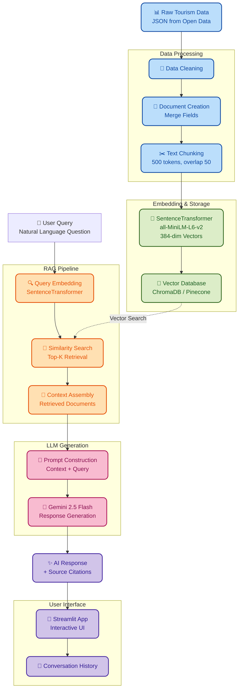

<p align="center">
  
</p>

# 🌍 Travel RAG Assistant

📚 Retrieval-Augmented Generation System for Tourism Information

LangChain • Gemini 2.5 Flash • ChromaDB • Pinecone • Streamlit

## 🌐 Live Demo

> Deployment in progress. Check back soon for the live application!

<p align="center">
  <!-- Environment / Tooling -->
  
  
  
  
  
  
  
  
</p>

---

# 📑 Table of Contents

- [Overview](#overview)
- [Current Dataset](#-current-dataset)
- [Tech Stack](#-tech-stack)
- [Project Layout](#-project-layout)
- [Quick Start](#-quick-start)
- [Notebook / Chapter Overview](#-notebook--chapter-overview)
- [RAG Pipeline Architecture](#-rag-pipeline-architecture)
- [Future Work](#-future-work)
- [License](#-license)

---

## Overview

This project builds a complete Retrieval-Augmented Generation (RAG) system for tourism information using modern LLM technologies.

**Current Status:** Vector database complete, ready for RAG pipeline (Chapters 01-04 completed)

**Goal:** Create an AI-powered travel assistant that can answer questions about Taiwan tourism by retrieving relevant information from a vector database and generating natural language responses using Google Gemini Pro.

**Key Components:**

- Government open data integration
- Vector database for semantic search
- LangChain for RAG orchestration  
- Streamlit for interactive web interface

## 📊 Current Dataset

- **Region**: Taiwan
- **Source**: [Taiwan Tourism Scenic Spots](https://media.taiwan.net.tw/XMLReleaseALL_public/scenic_spot_C_f.json)
- **Records**: 5,086 attractions
- **Coverage**: Taiwan (22 cities/counties)
- **Format**: JSON (Government Open Data)
- **Fields**: Name, Description, Address, Region, Opening Hours, Ticket Info, GPS Coordinates

## 🛠️ Tech Stack

### **Core Components**

| Component | Technology | Purpose |
|-----------|-----------|---------|
| **LLM** | Gemini 2.5 Flash | Text generation and question answering |
| **Embedding** | sentence-transformers (all-MiniLM-L6-v2) | Document vectorization (384 dimensions) |
| **Vector DB (Dev)** | ChromaDB | Local vector storage and retrieval |
| **Vector DB (Prod)** | Pinecone | Cloud-based vector database |
| **RAG Framework** | LangChain | Pipeline orchestration |
| **Frontend** | Streamlit | Interactive web interface |
| **Data Processing** | Pandas | Data manipulation and cleaning |

### **Development Tools**

- **Python**: 3.13
- **Package Manager**: Poetry
- **Environment**: python-dotenv
- **Logging**: Custom emoji logger

---

## 📁 Project Layout

```text
.
├─ data/
│  ├─ raw/                # Original JSON data
│  │  └─ scenic_spot.json
│  └─ processed/          # Processed documents & chunks
│
├─ chroma_db/             # ChromaDB vector storage (local)
│
├─ notebook/              # Jupyter Notebooks (exploration)
│  ├─ 01_data_exploration.ipynb
│  ├─ 02_data_processing.ipynb
│  ├─ 03_gemini_api_testing.ipynb
│  ├─ 04_vectordb_setup.ipynb
│  ├─ 05_rag_pipeline.ipynb
│  └─ 06_streamlit_app.ipynb
│
├─ src/
│  ├─ app/                # Streamlit web application
│  │  └─ app.py
│  ├─ data_collection/    # Data scraping/API scripts
│  ├─ rag/                # RAG pipeline implementation
│  │  └─ pipeline.py
│  ├─ utils/              # Utilities (logger, helpers)
│  │  ├─ logger.py
│  │  └─ emoji_log.py    # Emoji-enhanced logging for notebooks
│  └─ config.py           # Configuration management
│
├─ scripts/               # Utility scripts
│  ├─ setup_chromadb.py
│  ├─ ingest_data.py
│  └─ test_rag.py
│
├─ .env.example           # Environment variables template
├─ .gitignore
├─ pyproject.toml
├─ poetry.lock
└─ README.md
```

---

## 🚀 Quick Start

### **1. Clone Repository**

```bash
git clone https://github.com/yourusername/travel_rag.git
cd travel_rag
```

### **2. Install Dependencies**

```bash
# Install Poetry (if not installed)
curl -sSL https://install.python-poetry.org | python3 -

# Install project dependencies
poetry install
```

### **3. Set Up Environment Variables**

```bash
# Copy example env file
cp .env.example .env

# Edit .env and add your API keys
GOOGLE_API_KEY=your_gemini_api_key_here
PINECONE_API_KEY=your_pinecone_api_key_here  # For deployment
PINECONE_ENV=your_pinecone_environment
```

### **4. Download Data**

Download the dataset and place it in `data/raw/`:

```bash
# Download from source
wget https://media.taiwan.net.tw/XMLReleaseALL_public/scenic_spot_C_f.json \
  -O data/raw/scenic_spot.json
```

### **5. Run Jupyter Notebooks**

```bash
# Start Jupyter
poetry run jupyter lab

# Open notebooks in order (01 → 02 → ...)
```

### **6. Run Streamlit App (After completing notebooks)**

```bash
poetry run streamlit run src/app/app.py
```

---

## Notebook / Chapter Overview

<details>
<summary><b>📊 Chapter 01 — Data Exploration</b></summary>

📓 `01_data_exploration.ipynb`

**Objectives:**

- Load and inspect Taiwan tourism dataset
- Analyze data structure and quality
- Check for missing values and duplicates
- Examine text field distributions
- Select fields suitable for RAG implementation

**Key Findings:**

- 5,086 attraction records across 22 cities/counties
- Average description length: ~108 characters
- No duplicate records
- Some missing values in optional fields (Address, Opening Hours)

**Output:**

- Understanding of data structure
- Field selection for document creation
- Document format design for RAG

</details>

---

<details>
<summary><b>⚙️ Chapter 02 — Data Processing & Chunking</b></summary>

📓 `02_data_processing.ipynb`

**Objectives:**

- Clean and standardize text data
- Merge relevant fields into unified documents
- Implement chunking strategy
- Save processed documents for vector database ingestion

**Implementation:**

- Document format: Name + Region + Address + Description + Metadata
- Text field cleaning: fillna('') for consistent handling
- Chunking analysis: Only 1.9% of documents exceed 500 characters
- Decision: No chunking needed for current dataset
- Output format: JSON with id, content, metadata

**Output:**

- `data/processed/documents.json` - 5,086 processed documents
- Average document length: ~204 characters
- Ready for embedding generation

</details>

---

<details>
<summary><b>🤖 Chapter 03 — Gemini API Testing</b></summary>

📓 `03_gemini_api_testing.ipynb`

**Objectives:**

- Set up Gemini API key from Google AI Studio
- Test Gemini 2.5 Flash for text generation
- Test text-embedding-004 for embeddings
- Verify embedding dimensions and consistency
- Check API rate limits and quotas

**Key Findings:**

- **LLM (Gemini 2.5 Flash):**
  - Rate limit: 20 requests/day (free tier)
  - Status: Working, sufficient for development
  
- **Embedding (text-embedding-004):**
  - Dimension: 768 (consistent across all text lengths)
  - Rate limit: No strict limit detected (25+ calls successful)
  - Supports both English and Chinese

**Output:**

- Confirmed API functionality for both LLM and embedding
- API quota summary and usage recommendations
- Ready for vector database ingestion

</details>

---

<details>
<summary><b>💾 Chapter 04 — Vector Database Setup</b></summary>

📓 `04_vectordb_setup.ipynb`

**Objectives:**

- Initialize ChromaDB for local development
- Create persistent collection for Taiwan attractions
- Generate embeddings for all 5,086 documents
- Ingest documents into vector database
- Test similarity search functionality

**Implementation:**

- ChromaDB PersistentClient (stored in `./chroma_db/`)
- Collection with metadata filtering support
- Batch embedding generation using text-embedding-004
- Progress tracking for large-scale ingestion

**Implementation:**

- ChromaDB PersistentClient (stored in `./chroma_db/`)
- Collection: `taiwan_attractions`
- Embedding model: **all-MiniLM-L6-v2** (384 dimensions)
- Metadata filtering support with `None` value handling
- All 5,086 documents successfully embedded

**Key Decisions:**

- Chose `all-MiniLM-L6-v2` over multilingual model for better accuracy
- Optimized for Chinese language queries
- Filtered `None` values from metadata to prevent errors

**Results:**

- ✅ All 5,086 documents embedded and stored
- ✅ Similarity search tested and validated
- ✅ Distance range: 0.5-1.5 for good matches
- ✅ Query speed: < 100ms
- ✅ Database size: ~15-20 MB

**Output:**

- Local vector database ready for RAG pipeline
- Verified retrieval accuracy with test queries
- Ready for Chapter 05 integration

</details>

---

## 🚧 Upcoming Chapters

<details>
<summary><b>🔗 Chapter 05 — RAG Pipeline Implementation</b> (In Progress)</summary>

📓 `05_rag_pipeline.ipynb`

**Objectives:**

- Build end-to-end RAG pipeline using LangChain
- Integrate retriever and LLM with modern LCEL approach
- Test question-answering functionality
- Optimize retrieval parameters

**Components:**

- Retriever: ChromaDB with HuggingFaceEmbeddings (all-MiniLM-L6-v2)
- LLM: Gemini 2.5 Flash with custom prompt template
- Chain: LCEL (LangChain Expression Language) pipeline
- Top-k retrieval: 3 most relevant documents

**Implementation:**

- Modern LCEL syntax for flexible pipeline composition
- Custom prompt template for Taiwan tourism Q&A
- Source document tracking and citations
- Streaming support for real-time responses

**Output:**

- Working RAG pipeline using LCEL
- Modularized code in `src/rag/pipeline.py`
- Test results and examples

</details>

---

<details>
<summary><b>🎨 Chapter 06 — Streamlit Application</b></summary>

📓 `06_streamlit_app.ipynb`

**Objectives:**

- Design and implement web interface
- Integrate RAG pipeline with UI
- Add conversation history
- Implement error handling and loading states

**Features:**

- Text input for questions
- Real-time AI responses
- Source document display
- Conversation history
- Responsive design

**Output:**

- Fully functional web application
- User-friendly interface
- Production-ready code

</details>

---

<details>
<summary><b>🚀 Chapter 07 — Deployment Preparation</b></summary>

📓 `07_deployment.ipynb`

**Objectives:**

- Migrate from ChromaDB to Pinecone
- Configure for Streamlit Cloud deployment
- Set up secrets management
- Test production environment

**Steps:**

- Create Pinecone index
- Migrate vector data
- Update configuration
- Generate requirements.txt
- Deploy to Streamlit Cloud

**Output:**

- Cloud-deployed application
- Live demo URL
- Deployment documentation

</details>

---

<details>
<summary><b>📖 Chapter 08 — Documentation & Showcase</b></summary>

📓 `08_documentation.ipynb`

**Objectives:**

- Create comprehensive README
- Design system architecture diagram
- Capture application screenshots
- Prepare demo materials

**Deliverables:**

- Updated README with all sections
- Architecture diagrams (Mermaid)
- Screenshots and demo video
- Interview presentation materials

**Output:**

- Job-ready portfolio project
- Complete documentation
- Professional presentation

</details>

---

## 🧩 RAG Pipeline Architecture



---

## 🔮 Future Work

- [ ] **Additional Data Sources** - Restaurants, hotels, activities
- [ ] **Conversation History** - Multi-turn dialogue support
- [ ] **Map Integration** - Interactive geo-spatial visualization
- [ ] **Response Evaluation** - Quality metrics and user feedback
- [ ] **API Deployment** - RESTful API for integration

---

## 📜 License

MIT License (free to use & modify)

---

<p align="center">
  <i>Built with ❤️ using LangChain and Google Gemini Pro</i>
</p>
