<p align="center">
  
</p>

# 🌍 Travel RAG Assistant

📚 Retrieval-Augmented Generation System for Tourism Information

LangChain • Gemini 2.5 Flash • ChromaDB • Pinecone • Streamlit

## 🌐 Live Demo

> Deployment in progress. Check back soon for the live application!

<p align="center">
  <!-- Environment / Tooling -->
  
  
  
  
  
  
  
  
</p>

---

# 📑 Table of Contents

- [Overview](#overview)
- [Current Dataset](#-current-dataset)
- [Tech Stack](#-tech-stack)
- [Project Layout](#-project-layout)
- [Quick Start](#-quick-start)
- [Notebook / Chapter Overview](#-notebook--chapter-overview)
- [RAG Pipeline Architecture](#-rag-pipeline-architecture)
- [Future Work](#-future-work)
- [License](#-license)

---

## Overview

This project builds a complete Retrieval-Augmented Generation (RAG) system for tourism information using modern LLM technologies.

**Current Status:** Data collection and enrichment complete (Chapters 01-02 completed)

**Goal:** Create an AI-powered travel assistant that can answer questions about Seattle tourism by retrieving relevant information from a vector database and generating natural language responses using Google Gemini.

**Key Components:**

- Geoapify API for attraction data
- Wikipedia API for detailed descriptions
- Vector database for semantic search
- LangChain for RAG orchestration  
- Streamlit for interactive web interface

## 📊 Current Dataset

- **Region**: Seattle, Washington, USA
- **Primary Source**: [Geoapify Places API](https://www.geoapify.com/)
- **Secondary Source**: [Wikipedia API](https://www.mediawiki.org/wiki/API:Main_page)
- **Records**: 62 attractions with Wikipedia descriptions
- **Coverage**: Seattle metropolitan area
- **Format**: JSON (enriched with location data and descriptions)
- **Fields**: Name, Description, Location (lat/lon), Address, Categories, Place ID

## 🛠️ Tech Stack

### **Core Components**

| Component | Technology | Purpose |
|-----------|-----------|---------|
| **LLM** | Gemini 2.5 Flash | Text generation and question answering |
| **Embedding** | sentence-transformers (all-MiniLM-L6-v2) | Document vectorization (384 dimensions) |
| **Vector DB (Dev)** | ChromaDB | Local vector storage and retrieval |
| **Vector DB (Prod)** | Pinecone | Cloud-based vector database |
| **RAG Framework** | LangChain | Pipeline orchestration |
| **Frontend** | Streamlit | Interactive web interface |
| **Data Processing** | Pandas | Data manipulation and cleaning |

### **Development Tools**

- **Python**: 3.13
- **Package Manager**: Poetry
- **Environment**: python-dotenv
- **Logging**: Custom emoji logger

---

## 📁 Project Layout

```text
.
├─ data/
│  ├─ raw/                      # Raw API responses
│  │  └─ Seattle_attractions_raw.json
│  └─ processed/                # Processed & enriched data
│     ├─ seattle_attractions_with_wikipedia.json
│     ├─ seattle_attractions_enriched_with_location.json
│     ├─ seattle_attractions_documents.json
│     └─ metadata.json
│
├─ chroma_db/                   # ChromaDB vector storage (local)
│
├─ notebook/                    # Jupyter Notebooks (exploration)
│  ├─ 01_data_exploration.ipynb      # Geoapify API & data collection
│  └─ 02_data_enrichment.ipynb       # Wikipedia descriptions & location data
│
├─ src/
│  ├─ app/                      # Streamlit web application
│  │  └─ app.py
│  ├─ data_collection/          # Data pipeline modules
│  │  ├─ geoapify_client.py    # Geoapify API client
│  │  ├─ wikipedia_client.py   # Wikipedia API client
│  │  ├─ collector.py          # Chapter 1 workflow
│  │  ├─ enricher.py           # Chapter 2 workflow
│  │  └─ document_builder.py   # RAG document formatting
│  ├─ rag/                      # RAG pipeline implementation
│  │  └─ pipeline.py
│  ├─ utils/                    # Utilities
│  │  ├─ logger.py
│  │  └─ emoji_log.py          # Emoji-enhanced logging
│  └─ config.py                 # Configuration management
│
├─ scripts/                     # Utility scripts
│  ├─ setup_chromadb.py
│  ├─ ingest_data.py
│  └─ test_rag.py
│
├─ .env.example                 # Environment variables template
├─ .gitignore
├─ pyproject.toml
├─ poetry.lock
└─ README.md
```

---

## 🚀 Quick Start

### **1. Clone Repository**

```bash
git clone https://github.com/chgwyellow/travel_rag.git
cd travel_rag
```

### **2. Install Dependencies**

```bash
# Install Poetry (if not installed)
curl -sSL https://install.python-poetry.org | python3 -

# Install project dependencies
poetry install
```

### **3. Set Up Environment Variables**

```bash
# Copy example env file
cp .env.example .env

# Edit .env and add your API keys
GEOAPIFY_API_KEY=your_geoapify_api_key_here
EMAIL=your_email@example.com  # For Wikipedia API User-Agent
GOOGLE_API_KEY=your_gemini_api_key_here  # For future RAG pipeline
```

### **4. Run Data Collection Pipeline**

Execute the automated data pipeline to collect and enrich Seattle attractions:

```bash
# Run the complete pipeline (Chapters 1-2)
poetry run python scripts/ingest_data.py
```

This will:

- Fetch attractions from Geoapify API
- Filter attractions with Wikipedia links
- Enrich with Wikipedia descriptions
- Create RAG-ready documents

**Output files** (in `data/`):

- `raw/Seattle_attractions_raw.json` - Raw Geoapify data
- `processed/Seattle_attractions_with_wikipedia.json` - Filtered attractions
- `processed/Seattle_attractions_enriched.json` - Enriched with descriptions
- `processed/Seattle_attractions_documents.json` - RAG-ready documents

### **5. Explore with Jupyter Notebooks (Optional)**

```bash
# Start Jupyter to explore the data collection process
poetry run jupyter lab

# Open notebooks:
# - 01_data_exploration.ipynb (Geoapify API exploration)
# - 02_data_enrichment.ipynb (Wikipedia enrichment process)
```

### **6. Run Streamlit App (Coming Soon)**

After completing RAG pipeline implementation:

```bash
poetry run streamlit run src/app/app.py
```

---

## 📓 Notebook / Chapter Overview

<details>
<summary><b>📊 Chapter 01 — Data Exploration (Geoapify API)</b></summary>

📓 `01_data_exploration.ipynb`

**Objectives:**

- Set up Geoapify API for Seattle attractions
- Fetch tourism data within Seattle bounding box
- Filter attractions with Wikipedia links
- Analyze data structure and quality
- Design document format for RAG

**Implementation:**

- Geoapify Places API with `tourism` category filter
- Bounding box: Seattle metropolitan area
- Filtered for attractions with Wikipedia data
- Saved raw data to `data/raw/Seattle_attractions_raw.json`

**Key Findings:**

- 62 attractions with Wikipedia links (from ~500 total)
- All attractions have place_id, name, and location data
- Wikipedia codes in format "language:title" (e.g., "en:Space Needle")
- Categories include landmarks, museums, parks, monuments

**Output:**

- `seattle_attractions_with_wikipedia.json` - 62 filtered attractions
- Document format design for RAG
- Ready for Wikipedia enrichment

</details>

---

<details>
<summary><b>✨ Chapter 02 — Data Enrichment (Wikipedia API)</b></summary>

📓 `02_data_enrichment.ipynb`

**Objectives:**

- Fetch Wikipedia descriptions for all 62 attractions
- Merge location data from raw Geoapify response
- Perform data quality analysis and cleaning
- Create RAG-ready document format
- Validate data completeness

**Implementation:**

- Wikipedia API with User-Agent header
- Batch fetching with 0.5s rate limiting
- Location data merge (lat, lon, address, city, state, postcode)
- Document format: Name + Location + Coordinates + Description

**Data Quality Results:**

- ✅ 62/62 attractions with descriptions (100% success)
- ✅ 0 duplicates (based on place_id)
- ✅ 27.4% descriptions contain special characters (normal)
- ✅ Average description length: 860 characters
- ✅ 100% data completeness

**Output:**

- `seattle_attractions_enriched_with_location.json` - Full enriched data
- `seattle_attractions_documents.json` - RAG-ready documents
- `metadata.json` - Updated with enrichment statistics
- Ready for vector database ingestion

</details>

---

## 🚧 Upcoming Chapters

<details>
<summary><b>🔗 Chapter 05 — RAG Pipeline Implementation</b> (In Progress)</summary>

📓 `05_rag_pipeline.ipynb`

**Objectives:**

- Build end-to-end RAG pipeline using LangChain
- Integrate retriever and LLM with modern LCEL approach
- Test question-answering functionality
- Optimize retrieval parameters

**Components:**

- Retriever: ChromaDB with HuggingFaceEmbeddings (all-MiniLM-L6-v2)
- LLM: Gemini 2.5 Flash with custom prompt template
- Chain: LCEL (LangChain Expression Language) pipeline
- Top-k retrieval: 3 most relevant documents

**Implementation:**

- Modern LCEL syntax for flexible pipeline composition
- Custom prompt template for Taiwan tourism Q&A
- Source document tracking and citations
- Streaming support for real-time responses

**Output:**

- Working RAG pipeline using LCEL
- Modularized code in `src/rag/pipeline.py`
- Test results and examples

</details>

---

<details>
<summary><b>🎨 Chapter 06 — Streamlit Application</b></summary>

📓 `06_streamlit_app.ipynb`

**Objectives:**

- Design and implement web interface
- Integrate RAG pipeline with UI
- Add conversation history
- Implement error handling and loading states

**Features:**

- Text input for questions
- Real-time AI responses
- Source document display
- Conversation history
- Responsive design

**Output:**

- Fully functional web application
- User-friendly interface
- Production-ready code

</details>

---

<details>
<summary><b>🚀 Chapter 07 — Deployment Preparation</b></summary>

📓 `07_deployment.ipynb`

**Objectives:**

- Migrate from ChromaDB to Pinecone
- Configure for Streamlit Cloud deployment
- Set up secrets management
- Test production environment

**Steps:**

- Create Pinecone index
- Migrate vector data
- Update configuration
- Generate requirements.txt
- Deploy to Streamlit Cloud

**Output:**

- Cloud-deployed application
- Live demo URL
- Deployment documentation

</details>

---

<details>
<summary><b>📖 Chapter 08 — Documentation & Showcase</b></summary>

📓 `08_documentation.ipynb`

**Objectives:**

- Create comprehensive README
- Design system architecture diagram
- Capture application screenshots
- Prepare demo materials

**Deliverables:**

- Updated README with all sections
- Architecture diagrams (Mermaid)
- Screenshots and demo video
- Interview presentation materials

**Output:**

- Job-ready portfolio project
- Complete documentation
- Professional presentation

</details>

---

## 🧩 RAG Pipeline Architecture

```mermaid
flowchart TD

%% ============================
%% COLOR THEMES
%% ============================
classDef data fill:#BBDEFB,stroke:#0D47A1,stroke-width:2px,color:#0D47A1,rx:10,ry:10
classDef process fill:#DCEDC8,stroke:#33691E,stroke-width:2px,color:#1B5E20,rx:10,ry:10
classDef rag fill:#FFE0B2,stroke:#E65100,stroke-width:2px,color:#E65100,rx:10,ry:10
classDef llm fill:#F8BBD0,stroke:#AD1457,stroke-width:2px,color:#880E4F,rx:10,ry:10
classDef ui fill:#D1C4E9,stroke:#4527A0,stroke-width:2px,color:#311B92,rx:10,ry:10

%% ============================
%% NODES
%% ============================

A["📊 Raw Tourism Data<br>JSON from Open Data"]

subgraph DATA[Data Processing]
    B1["🧹 Data Cleaning"]
    B2["📝 Document Creation<br>Merge Fields"]
    B3["✂️ Text Chunking<br>500 tokens, overlap 50"]
end

subgraph EMBED[Embedding & Storage]
    C1["🤖 SentenceTransformer<br>all-MiniLM-L6-v2<br>384-dim Vectors"]
    C2["💾 Vector Database<br>ChromaDB / Pinecone"]
end

D["👤 User Query<br>Natural Language Question"]

subgraph RAG[RAG Pipeline]
    E1["🔍 Query Embedding<br>SentenceTransformer"]
    E2["🎯 Similarity Search<br>Top-K Retrieval"]
    E3["📄 Context Assembly<br>Retrieved Documents"]
end

subgraph LLM[LLM Generation]
    F1["💬 Prompt Construction<br>Context + Query"]
    F2["🧠 Gemini 2.5 Flash<br>Response Generation"]
end

G["✨ AI Response<br>+ Source Citations"]

subgraph UI[User Interface]
    H1["🎨 Streamlit App<br>Interactive UI"]
    H2["💬 Conversation History"]
end

%% ============================
%% FLOWS
%% ============================

A --> B1 --> B2 --> B3 --> C1 --> C2

D --> E1 --> E2
C2 -.->|Vector Search| E2
E2 --> E3 --> F1 --> F2 --> G --> H1 --> H2

%% ============================
%% CLASS ASSIGNMENTS
%% ============================

class A,B1,B2,B3 data
class C1,C2 process
class E1,E2,E3 rag
class F1,F2 llm
class G,H1,H2 ui
```



---

## 🔮 Future Work

- [ ] **Additional Data Sources** - Restaurants, hotels, activities
- [ ] **Conversation History** - Multi-turn dialogue support
- [ ] **Map Integration** - Interactive geo-spatial visualization
- [ ] **Response Evaluation** - Quality metrics and user feedback
- [ ] **API Deployment** - RESTful API for integration

---

## 📜 License

MIT License (free to use & modify)

---

<p align="center">
  <i>Built with ❤️ using LangChain and Google Gemini Pro</i>
</p>
